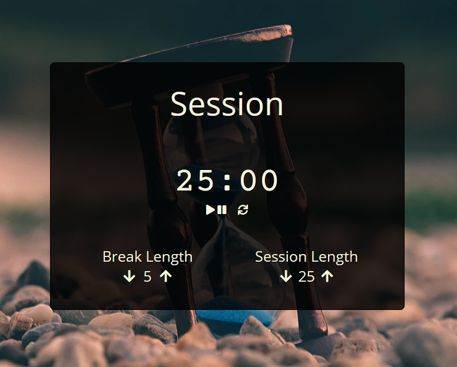

# 25plus5clock

esse é um [projeto sugerido](https://www.freecodecamp.org/learn/front-end-libraries/front-end-libraries-projects/build-a-25--5-clock) pela [freeCodeCamp](https://www.freecodecamp.org/) para a obtenção da certificação de Front End Libraries.

escolhi desenvolvê-lo em ReactJS, e segui as user stories pontuadas na sugestão do projeto como diretrizes. 

dentre os 5 projetos realizados para receber a certificação, este foi o mais desafiador, visto que tive que aprender a mexer com o Date Object.

o desafio real foi pensar em como construir o contador de maneira que não houvesse alguma dessincronização ao longo da contagem regressiva do relógio.

# clique [aqui](https://codepen.io/fabiokannenberg/full/LYboQaM) para ver o app em funcionamento

